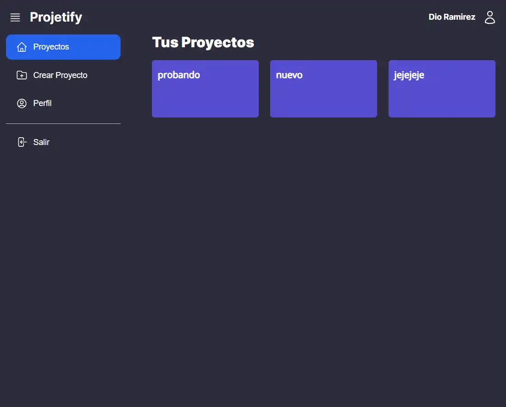

# Proyecto de Gestión de Proyectos



## Iniciar el proyecto

Primero se debe crear el contenedor con el siguiente comando:

```bash
docker-compose up -d
```

luego se debe importar las tablas a la base de datos con el siguiente comando:

```bash
docker exec -i mysql mysql -u root -pdevelopment < ./database/projetify.sql
```

siguiente, se debe declarar las variables de entorno en el archivo .env, para esto se debe copiar el archivo .env.example y renombrarlo a .env, luego se debe modificar las siguientes variables:

```bash
DB_HOST = localhost
DB_NAME = projetify
DB_CHARSET = utf8
DB_USER = root
DB_PASS = development

EMAIL_HOST = aquí: servicio de prueba de mailtrap u otro servicio de correo
EMAIL_PORT = aquí: servicio de prueba de mailtrap u otro servicio de correo
EMAIL_USER = aquí: servicio de prueba de mailtrap u otro servicio de correo
EMAIL_PASS = aquí: servicio de prueba de mailtrap u otro servicio de correo
EMAIL_SECURE = true o false
```

una ves hecho lo anterior, se debe instalar las dependencias del proyecto con el siguiente comando:

```bash
npm install
```

y luego se debe instalar las dependencias de composer con el siguiente comando:

```bash
composer update
```

finalmente, se debe acceder a la carpeta public con el siguiente comando:

```bash
cd public
```

y ejecutar el siguiente comando:

```bash
php -S localhost:3000
```

y listo, ya se puede acceder al proyecto desde el navegador con la siguiente url:

```bash
http://localhost:3000
```
